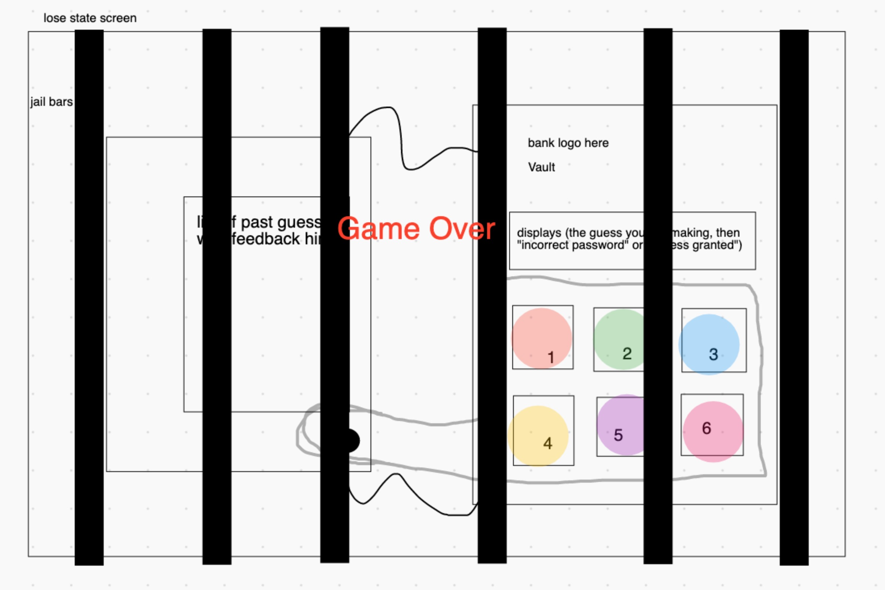
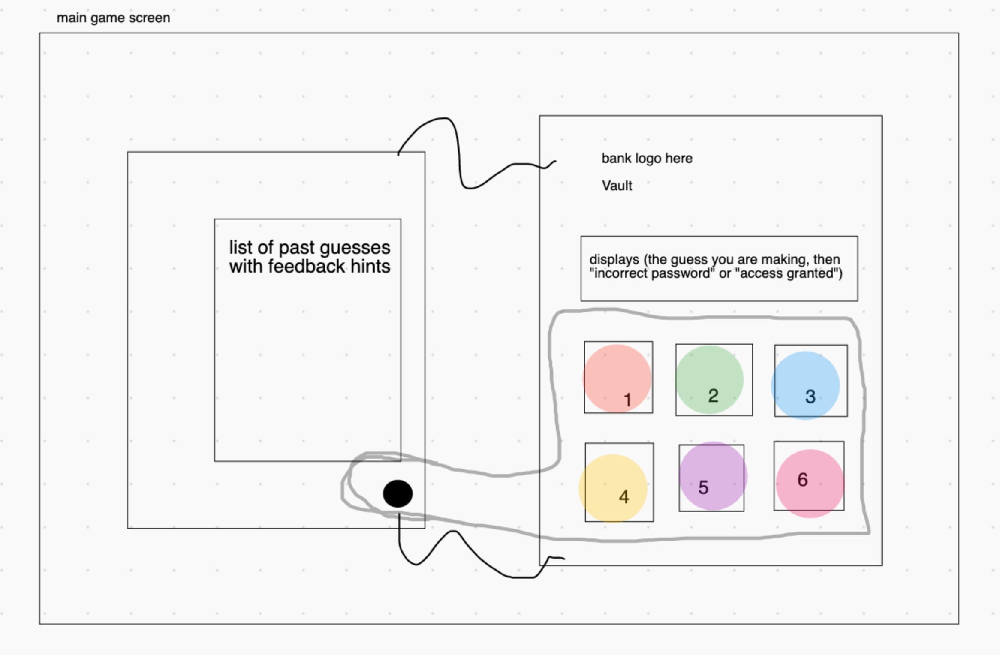
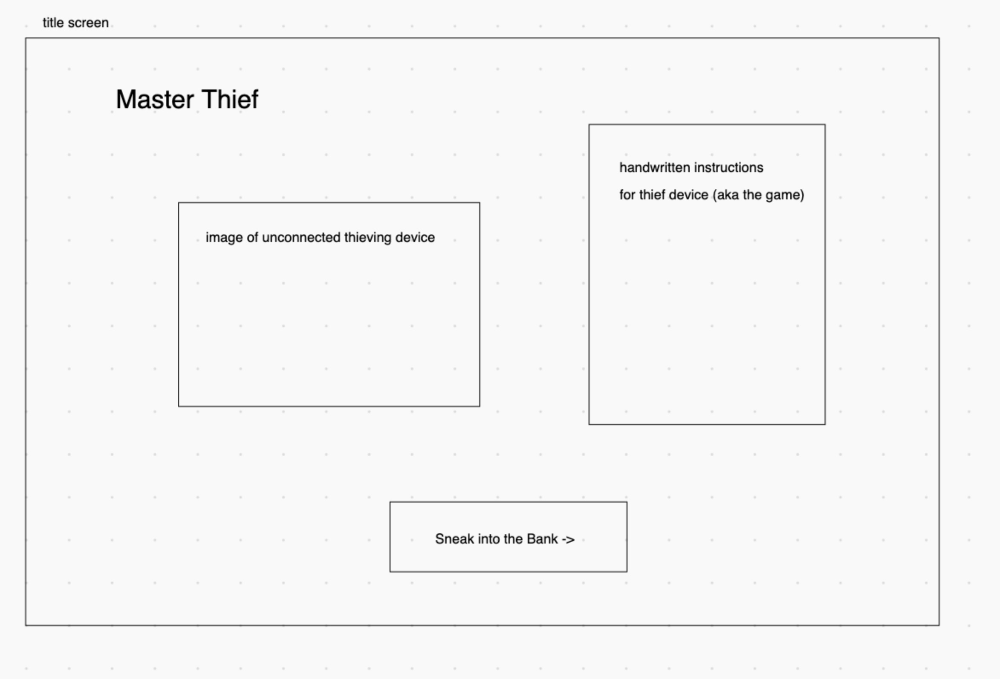
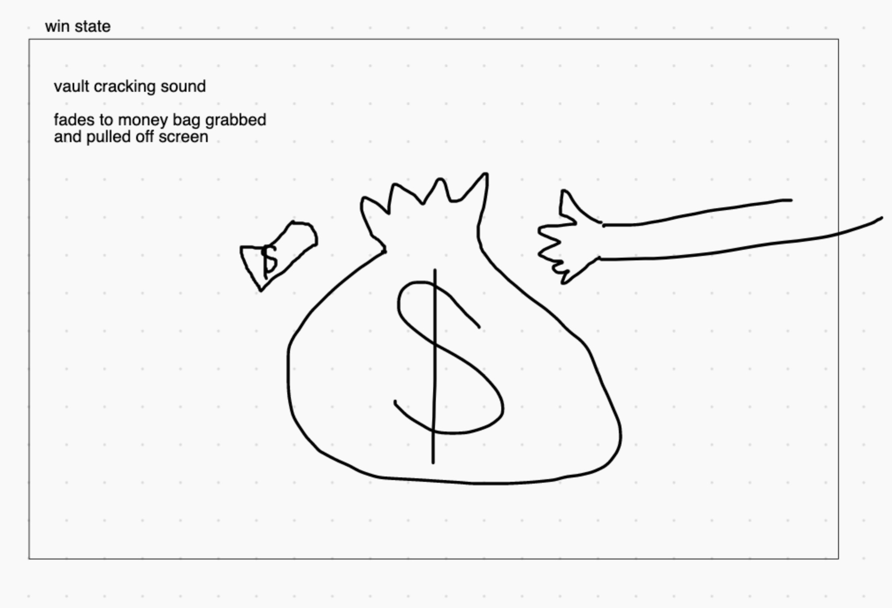

### Link to Game!
https://connorcourtney123.github.io/project1/

# MasterThief

## A High-Stakes Game of Logic and Deduction

* Overview:
    My idea is a twist on the classic board game MasterMind! In this game, the player is a thief trying to crack a bank vault without triggering the alarm or before the police arrive. 

* Game Rules:
    1. The hacking device our thief is using simplifies the vault lock to a four color combination. This can be any combination of the six colors, including double colors.(ex. orange orange yellow blue)
    
    2. The player guesses the color combination and arrangement attempting to duplicate the secret code.

    3. The hacking device provides feedback on each guess, telling the player if they have the correct color and if it is in the correct position. 

        A red color for each guess that is the correct color in the correct spot.

        A white color for each guess that is the correct color in the INcorrect spot.

        No feedback for incorrect color.

    4. It is part of the challenge for the player to figure out which feedback colors correspond to which part of the code they entered.

    5. If the player guesses the correct combination within the 10-guess limit, they win the game. If they go over 10 guesses, it is a loss.

* User Stories
    User is presented with instructions on how to play the game, and the user has a start button to begin the game.
    
    * When the user clicks start the game begins.
    * User clicks on colors to form a 4 color guess.
    * Based on the feedback our AI gives the User continues to guess and hopefully get closer to the answer.
    * If the user guesses correctly, the games ends and user wins.
    * If the user is incorrect on 10th guess game ends and user loses.

* MVP Checklist
    * working start button
    * 6 working buttons to form guesses
    * randomly generated 4 character code
    * win state/lose state
    * checking if code is correct or not
    * display guess history with feedback hints
    * feedback hint gives visual indication of how many colors were correct and how many were correct and in the correct position

* Stretch Goals
    * Visual/audio indication that the police are closing in with each incorrect guess
    * animation of our vault cracking device being attached
    * device animation between each guess
    * add a sense of urgency

    
    
    
    
    
